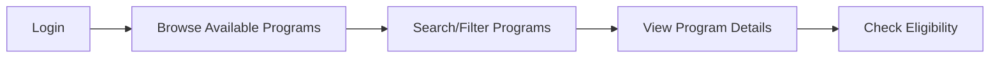
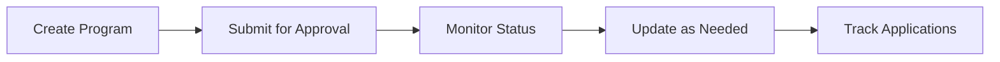
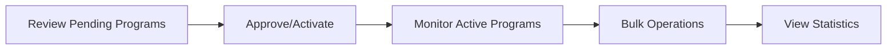

# Credit Program API - User Guide

A practical guide for developers integrating with the Credit Program API. This guide focuses on the most common use cases and provides ready-to-use examples.

## Table of Contents
1. [Quick Start](#quick-start)
2. [User Role Workflows](#user-role-workflows)
3. [Essential API Endpoints](#essential-api-endpoints)
4. [Error Handling & Troubleshooting](#error-handling--troubleshooting)
5. [Frontend Integration](#frontend-integration)
6. [Quick Reference](#quick-reference)

---

## Quick Start

### 1. Authentication

All API requests require JWT authentication. Get your token first:

```bash
# Login to get JWT token
curl -X POST http://localhost:8080/api/auth/login \
  -H "Content-Type: application/json" \
  -d '{
    "username": "your_username", 
    "password": "your_password"
  }'
```

**Response:**
```json
{
  "token": "eyJhbGciOiJIUzI1NiJ9...",
  "user": {
    "username": "credit_manager",
    "roles": ["CREDIT_MANAGER"]
  },
  "expiresIn": 86400
}
```

### 2. Your First API Call

Use the token in all subsequent requests:

```bash
# Get available credit programs
curl -X GET http://localhost:8080/api/credit-programs/available \
  -H "Authorization: Bearer YOUR_JWT_TOKEN" \
  -H "Accept: application/json"
```

### 3. Base Configuration

```javascript
// API Client Configuration
const API_BASE_URL = 'http://localhost:8080/api/credit-programs';
const headers = {
  'Content-Type': 'application/json',
  'Authorization': `Bearer ${localStorage.getItem('jwt_token')}`,
  'Accept': 'application/json'
};
```

---

## User Role Workflows

### 👤 End Users (Any authenticated user)
**Goal**: Browse and find suitable credit programs



**Common API Sequence:**
```javascript
// 1. Get available programs
const programs = await fetch(`${API_BASE_URL}/available`, { headers });

// 2. Search with filters
const searchResults = await fetch(`${API_BASE_URL}/search`, {
  method: 'POST',
  headers,
  body: JSON.stringify({
    searchTerm: 'business',
    activeOnly: true,
    minAmount: 100000,
    maxAmount: 1000000
  })
});

// 3. Get specific program details
const program = await fetch(`${API_BASE_URL}/${programId}`, { headers });
```

### 👩‍💼 Credit Staff (CREDIT_ANALYST, CREDIT_MANAGER)
**Goal**: Create and manage credit programs



**Create Program Example:**
```javascript
const newProgram = {
  decisionId: "123e4567-e89b-12d3-a456-426614174000",
  nameEn: "Small Business Loan",
  nameRu: "Кредит для малого бизнеса", 
  nameKg: "Чакан бизнес үчүн кредит",
  creditPurposeId: 1,
  currencyId: 1,
  repaymentOrderId: 1,
  collateralRequired: true,
  termMin: 12,
  termMax: 60,
  amountMin: 100000,
  amountMax: 5000000,
  interestRateFixed: 18.0,
  status: "DRAFT"
};

const response = await fetch(API_BASE_URL, {
  method: 'POST',
  headers,
  body: JSON.stringify(newProgram)
});
```

### 👨‍💼 Managers (ADMIN, CREDIT_MANAGER)
**Goal**: Approve programs and monitor performance



**Manager Operations:**
```javascript
// Activate a program
await fetch(`${API_BASE_URL}/${programId}/activate`, {
  method: 'PATCH',
  headers
});

// Get expiring programs (next 30 days)
const expiring = await fetch(`${API_BASE_URL}/expiring/30`, { headers });

// Bulk status update
await fetch(`${API_BASE_URL}/bulk/status?status=SUSPENDED`, {
  method: 'PATCH',
  headers,
  body: JSON.stringify({
    programIds: ['id1', 'id2', 'id3'],
    reason: 'Quarterly review suspension'
  })
});

// Get statistics
const stats = await fetch(`${API_BASE_URL}/statistics`, { headers });
```

---

## Essential API Endpoints

### 1. 📋 Get Available Programs
**Most used endpoint for browsing active programs**

```http
GET /api/credit-programs/available?page=0&size=20&sort=nameEn,asc
```

```javascript
// JavaScript example
const getAvailablePrograms = async (page = 0, size = 20) => {
  const response = await fetch(
    `${API_BASE_URL}/available?page=${page}&size=${size}&sort=nameEn,asc`,
    { headers }
  );
  return response.json();
};
```

### 2. 🔍 Search Programs
**Flexible search with multiple filters**

```http
POST /api/credit-programs/search
```

```javascript
const searchPrograms = async (filters) => {
  const searchPayload = {
    searchTerm: filters.keyword,
    status: filters.status,
    collateralRequired: filters.needsCollateral,
    minAmount: filters.minAmount,
    maxAmount: filters.maxAmount,
    activeOnly: true
  };
  
  const response = await fetch(`${API_BASE_URL}/search`, {
    method: 'POST',
    headers,
    body: JSON.stringify(searchPayload)
  });
  return response.json();
};
```

### 3. 📄 Get Program Details
**Get complete program information**

```http
GET /api/credit-programs/{id}
```

```javascript
const getProgramDetails = async (programId) => {
  const response = await fetch(`${API_BASE_URL}/${programId}`, { headers });
  if (!response.ok) throw new Error('Program not found');
  return response.json();
};
```

### 4. ➕ Create Program
**For credit staff to create new programs**

```http
POST /api/credit-programs
```

```javascript
const createProgram = async (programData) => {
  const response = await fetch(API_BASE_URL, {
    method: 'POST',
    headers,
    body: JSON.stringify(programData)
  });
  
  if (!response.ok) {
    const error = await response.json();
    throw new Error(error.message);
  }
  
  return response.json();
};
```

### 5. 🔄 Update Program Status
**For managers to change program status**

```http
PATCH /api/credit-programs/{id}/status
```

```javascript
const updateProgramStatus = async (programId, status, reason = '') => {
  const response = await fetch(`${API_BASE_URL}/${programId}/status`, {
    method: 'PATCH',
    headers,
    body: JSON.stringify({ status, reason })
  });
  return response.json();
};

// Quick status change methods
const activateProgram = (id) => updateProgramStatus(id, 'ACTIVE');
const suspendProgram = (id, reason) => updateProgramStatus(id, 'SUSPENDED', reason);
```

### 6. ✅ Check Program Availability
**Verify if program can be used for applications**

```http
GET /api/credit-programs/{id}/available
```

```javascript
const isProgramAvailable = async (programId) => {
  const response = await fetch(`${API_BASE_URL}/${programId}/available`, { headers });
  return response.json(); // returns boolean
};
```

### 7. 📊 Get Program Statistics
**For managers to monitor overall performance**

```http
GET /api/credit-programs/statistics
```

```javascript
const getProgramStatistics = async () => {
  const response = await fetch(`${API_BASE_URL}/statistics`, { headers });
  return response.json();
};

// Returns:
// {
//   totalPrograms: 25,
//   activePrograms: 12,
//   pendingApprovalPrograms: 2,
//   programsExpiringWithin30Days: 4
// }
```

### 8. 📝 Get Program Summaries
**Lightweight data for dropdowns and lists**

```http
GET /api/credit-programs/summaries?size=50
```

```javascript
const getProgramSummaries = async () => {
  const response = await fetch(`${API_BASE_URL}/summaries?size=50`, { headers });
  return response.json();
};
```

---

## Error Handling & Troubleshooting

### Common HTTP Status Codes

| Status | Meaning | Common Causes | Solution |
|--------|---------|---------------|----------|
| 400 | Bad Request | Invalid data format, missing required fields | Check request body against API schema |
| 401 | Unauthorized | Missing or expired JWT token | Re-authenticate and get new token |
| 403 | Forbidden | Insufficient permissions | Check user roles and endpoint requirements |
| 404 | Not Found | Program ID doesn't exist | Verify program ID is correct |
| 409 | Conflict | Business rule violation | Check status transitions and validation rules |
| 422 | Validation Error | Business logic constraints failed | Review error details and fix data |

### Authentication Issues

**Problem**: Getting 401 Unauthorized
```javascript
// ❌ Common mistake
fetch('/api/credit-programs', {
  headers: { 'Authorization': 'your-token-here' }
});

// ✅ Correct format  
fetch('/api/credit-programs', {
  headers: { 'Authorization': `Bearer ${token}` }
});
```

**Problem**: Token expired
```javascript
// Handle token refresh
const apiCall = async (url, options) => {
  let response = await fetch(url, options);
  
  if (response.status === 401) {
    // Token expired, refresh and retry
    await refreshToken();
    options.headers.Authorization = `Bearer ${getToken()}`;
    response = await fetch(url, options);
  }
  
  return response;
};
```

### Validation Errors

**Example 400 Error Response:**
```json
{
  "status": 400,
  "message": "Validation failed",
  "errors": [
    {
      "field": "nameEn",
      "message": "Name in English is required",
      "rejectedValue": null
    },
    {
      "field": "amountMin", 
      "message": "Minimum amount must be positive",
      "rejectedValue": -1000
    }
  ]
}
```

**Handle validation errors:**
```javascript
const handleApiError = (error) => {
  if (error.status === 400 && error.errors) {
    // Field validation errors
    const fieldErrors = {};
    error.errors.forEach(err => {
      fieldErrors[err.field] = err.message;
    });
    return { fieldErrors };
  }
  
  return { generalError: error.message };
};
```

### Status Transition Errors

**Problem**: Cannot change status (409 Conflict)

Valid transitions:
- `DRAFT` → `PENDING_APPROVAL` or `CANCELLED`
- `PENDING_APPROVAL` → `APPROVED`, `REJECTED`, or `CANCELLED`  
- `APPROVED` → `ACTIVE` or `CANCELLED`
- `ACTIVE` → `SUSPENDED` or `CLOSED`
- `SUSPENDED` → `ACTIVE` or `CLOSED`

```javascript
const isValidTransition = (currentStatus, newStatus) => {
  const validTransitions = {
    'DRAFT': ['PENDING_APPROVAL', 'CANCELLED'],
    'PENDING_APPROVAL': ['APPROVED', 'REJECTED', 'CANCELLED'],
    'APPROVED': ['ACTIVE', 'CANCELLED'], 
    'ACTIVE': ['SUSPENDED', 'CLOSED'],
    'SUSPENDED': ['ACTIVE', 'CLOSED']
  };
  
  return validTransitions[currentStatus]?.includes(newStatus);
};
```

### Network and Connection Issues

```javascript
// Retry mechanism for network issues
const apiWithRetry = async (url, options, maxRetries = 3) => {
  for (let i = 0; i < maxRetries; i++) {
    try {
      const response = await fetch(url, options);
      if (response.ok) return response;
      
      if (response.status >= 400 && response.status < 500) {
        // Client error, don't retry
        throw new Error(`Client error: ${response.status}`);
      }
      
    } catch (error) {
      if (i === maxRetries - 1) throw error;
      await new Promise(resolve => setTimeout(resolve, 1000 * (i + 1)));
    }
  }
};
```

---

## Frontend Integration

### React Components

#### 1. Status Badge Component
```jsx
const StatusBadge = ({ status, language = 'en' }) => {
  const statusConfig = {
    'DRAFT': { color: 'gray', label: { en: 'Draft', ru: 'Черновик', kg: 'Долбоор' }},
    'ACTIVE': { color: 'green', label: { en: 'Active', ru: 'Активный', kg: 'Активдүү' }},
    'SUSPENDED': { color: 'orange', label: { en: 'Suspended', ru: 'Приостановлен', kg: 'Токтотулган' }},
    'CLOSED': { color: 'red', label: { en: 'Closed', ru: 'Закрыт', kg: 'Жабылган' }}
  };

  const config = statusConfig[status] || statusConfig['DRAFT'];
  
  return (
    <span className={`badge badge-${config.color}`}>
      {config.label[language]}
    </span>
  );
};
```

#### 2. Program Search Component
```jsx
const ProgramSearch = ({ onResults, onError }) => {
  const [filters, setFilters] = useState({
    searchTerm: '',
    status: '',
    collateralRequired: null,
    minAmount: '',
    maxAmount: ''
  });
  
  const [loading, setLoading] = useState(false);

  const handleSearch = async () => {
    setLoading(true);
    try {
      const results = await searchPrograms(filters);
      onResults(results.content);
    } catch (error) {
      onError(error.message);
    } finally {
      setLoading(false);
    }
  };

  return (
    <div className="program-search">
      <div className="search-fields">
        <input
          type="text"
          placeholder="Search programs..."
          value={filters.searchTerm}
          onChange={(e) => setFilters({...filters, searchTerm: e.target.value})}
        />
        
        <select 
          value={filters.status}
          onChange={(e) => setFilters({...filters, status: e.target.value})}
        >
          <option value="">All Statuses</option>
          <option value="ACTIVE">Active</option>
          <option value="SUSPENDED">Suspended</option>
        </select>

        <input
          type="number"
          placeholder="Min Amount"
          value={filters.minAmount}
          onChange={(e) => setFilters({...filters, minAmount: e.target.value})}
        />
        
        <input
          type="number" 
          placeholder="Max Amount"
          value={filters.maxAmount}
          onChange={(e) => setFilters({...filters, maxAmount: e.target.value})}
        />
      </div>
      
      <button onClick={handleSearch} disabled={loading}>
        {loading ? 'Searching...' : 'Search'}
      </button>
    </div>
  );
};
```

#### 3. Program List Component
```jsx
const ProgramList = ({ programs, onProgramSelect, userRole }) => {
  const canModify = ['ADMIN', 'CREDIT_MANAGER'].includes(userRole);
  
  return (
    <div className="program-list">
      {programs.map(program => (
        <div key={program.id} className="program-card">
          <div className="program-header">
            <h3>{program.nameEn}</h3>
            <StatusBadge status={program.status} />
          </div>
          
          <div className="program-details">
            <p><strong>Amount:</strong> {program.amountMin?.toLocaleString()} - {program.amountMax?.toLocaleString()} {program.currencyCode}</p>
            <p><strong>Term:</strong> {program.termMin} - {program.termMax} months</p>
            <p><strong>Interest Rate:</strong> {program.interestRateFixed}%</p>
            <p><strong>Collateral Required:</strong> {program.collateralRequired ? 'Yes' : 'No'}</p>
          </div>
          
          <div className="program-actions">
            <button onClick={() => onProgramSelect(program.id)}>
              View Details
            </button>
            
            {canModify && program.status === 'APPROVED' && (
              <button 
                onClick={() => updateProgramStatus(program.id, 'ACTIVE')}
                className="btn-activate"
              >
                Activate
              </button>
            )}
          </div>
        </div>
      ))}
    </div>
  );
};
```

### State Management (Redux Toolkit)

```javascript
// creditProgramSlice.js
import { createSlice, createAsyncThunk } from '@reduxjs/toolkit';

// Async thunks
export const fetchPrograms = createAsyncThunk(
  'creditPrograms/fetchPrograms',
  async ({ page = 0, size = 20, filters = {} }) => {
    const response = await searchPrograms({ ...filters, page, size });
    return response;
  }
);

export const createProgram = createAsyncThunk(
  'creditPrograms/createProgram', 
  async (programData) => {
    const response = await fetch('/api/credit-programs', {
      method: 'POST',
      headers: getAuthHeaders(),
      body: JSON.stringify(programData)
    });
    return response.json();
  }
);

const creditProgramSlice = createSlice({
  name: 'creditPrograms',
  initialState: {
    programs: [],
    currentProgram: null,
    loading: false,
    error: null,
    pagination: {
      page: 0,
      totalPages: 0,
      totalElements: 0
    }
  },
  reducers: {
    setCurrentProgram: (state, action) => {
      state.currentProgram = action.payload;
    },
    clearError: (state) => {
      state.error = null;
    }
  },
  extraReducers: (builder) => {
    builder
      .addCase(fetchPrograms.pending, (state) => {
        state.loading = true;
        state.error = null;
      })
      .addCase(fetchPrograms.fulfilled, (state, action) => {
        state.loading = false;
        state.programs = action.payload.content;
        state.pagination = {
          page: action.payload.number,
          totalPages: action.payload.totalPages,
          totalElements: action.payload.totalElements
        };
      })
      .addCase(fetchPrograms.rejected, (state, action) => {
        state.loading = false;
        state.error = action.error.message;
      });
  }
});

export const { setCurrentProgram, clearError } = creditProgramSlice.actions;
export default creditProgramSlice.reducer;
```

### API Service Layer

```javascript
// creditProgramAPI.js
class CreditProgramAPI {
  constructor(baseURL = '/api/credit-programs') {
    this.baseURL = baseURL;
  }

  async request(endpoint, options = {}) {
    const url = `${this.baseURL}${endpoint}`;
    const config = {
      headers: {
        'Content-Type': 'application/json',
        'Authorization': `Bearer ${localStorage.getItem('jwt_token')}`,
        ...options.headers
      },
      ...options
    };

    const response = await fetch(url, config);
    
    if (!response.ok) {
      const error = await response.json().catch(() => ({ message: 'Network error' }));
      throw new APIError(error.message, response.status, error);
    }

    return response.json();
  }

  // Core methods
  async getPrograms(page = 0, size = 20) {
    return this.request(`?page=${page}&size=${size}&sort=nameEn,asc`);
  }

  async getAvailablePrograms(page = 0, size = 20) {
    return this.request(`/available?page=${page}&size=${size}`);
  }

  async searchPrograms(searchCriteria, page = 0, size = 20) {
    return this.request(`/search?page=${page}&size=${size}`, {
      method: 'POST',
      body: JSON.stringify(searchCriteria)
    });
  }

  async getProgramById(id) {
    return this.request(`/${id}`);
  }

  async createProgram(programData) {
    return this.request('', {
      method: 'POST',
      body: JSON.stringify(programData)
    });
  }

  async updateProgramStatus(id, status, reason = '') {
    return this.request(`/${id}/status`, {
      method: 'PATCH',
      body: JSON.stringify({ status, reason })
    });
  }

  async getStatistics() {
    return this.request('/statistics');
  }

  // Convenience methods
  async activateProgram(id) {
    return this.request(`/${id}/activate`, { method: 'PATCH' });
  }

  async suspendProgram(id, reason) {
    return this.request(`/${id}/suspend?reason=${encodeURIComponent(reason)}`, { 
      method: 'PATCH' 
    });
  }
}

class APIError extends Error {
  constructor(message, status, details) {
    super(message);
    this.status = status;
    this.details = details;
  }
}

export const creditProgramAPI = new CreditProgramAPI();
```

### Form Validation

```javascript
// validation.js - Client-side validation matching backend rules
export const validateProgramData = (data) => {
  const errors = {};

  // Required fields
  if (!data.nameEn?.trim()) errors.nameEn = 'English name is required';
  if (!data.nameRu?.trim()) errors.nameRu = 'Russian name is required'; 
  if (!data.nameKg?.trim()) errors.nameKg = 'Kyrgyz name is required';
  if (!data.decisionId) errors.decisionId = 'Decision is required';
  if (!data.creditPurposeId) errors.creditPurposeId = 'Credit purpose is required';
  if (!data.currencyId) errors.currencyId = 'Currency is required';

  // Length validations
  if (data.nameEn && data.nameEn.length > 100) {
    errors.nameEn = 'Name cannot exceed 100 characters';
  }
  
  // Amount validations
  if (data.amountMin && data.amountMin <= 0) {
    errors.amountMin = 'Minimum amount must be positive';
  }
  if (data.amountMax && data.amountMax <= 0) {
    errors.amountMax = 'Maximum amount must be positive';
  }
  if (data.amountMin && data.amountMax && data.amountMin >= data.amountMax) {
    errors.amountMax = 'Maximum amount must be greater than minimum amount';
  }

  // Term validations
  if (data.termMin && data.termMin <= 0) {
    errors.termMin = 'Minimum term must be positive';
  }
  if (data.termMax && data.termMax <= 0) {
    errors.termMax = 'Maximum term must be positive';
  }
  if (data.termMin && data.termMax && data.termMin >= data.termMax) {
    errors.termMax = 'Maximum term must be greater than minimum term';
  }

  // Interest rate validation
  if (data.interestRateFixed && data.interestRateFixed < 0) {
    errors.interestRateFixed = 'Interest rate cannot be negative';
  }

  // Collateral validations
  if (data.collateralRequired) {
    if (!data.acceptedCollateralTypes || data.acceptedCollateralTypes.length === 0) {
      errors.acceptedCollateralTypes = 'At least one collateral type must be selected when collateral is required';
    }
    if (!data.minimumCollateralCoverageRatio || data.minimumCollateralCoverageRatio <= 0) {
      errors.minimumCollateralCoverageRatio = 'Minimum collateral coverage ratio must be positive when collateral is required';
    }
  }

  return {
    isValid: Object.keys(errors).length === 0,
    errors
  };
};
```

---

## Quick Reference

### Status Workflow
```
DRAFT → PENDING_APPROVAL → APPROVED → ACTIVE → SUSPENDED/CLOSED
  ↓           ↓               ↓
CANCELLED   REJECTED      CANCELLED
```

### Permission Matrix

| Endpoint | Public | User | Credit Staff | Manager | Admin |
|----------|--------|------|--------------|---------|-------|
| Get Programs | ❌ | ✅ | ✅ | ✅ | ✅ |
| Search Programs | ❌ | ✅ | ✅ | ✅ | ✅ |
| Create Program | ❌ | ❌ | ✅ | ✅ | ✅ |
| Update Program | ❌ | ❌ | ✅ | ✅ | ✅ |
| Change Status | ❌ | ❌ | ❌ | ✅ | ✅ |
| Delete Program | ❌ | ❌ | ❌ | ❌ | ✅ |
| View Statistics | ❌ | ❌ | ❌ | ✅ | ✅ |

### Common Status Codes
- **200**: Success (GET, PUT, PATCH)
- **201**: Created (POST)  
- **204**: No Content (DELETE)
- **400**: Bad Request (validation failed)
- **401**: Unauthorized (missing/invalid token)
- **403**: Forbidden (insufficient permissions)
- **404**: Not Found (resource doesn't exist)
- **409**: Conflict (business rule violation)
- **422**: Unprocessable Entity (business validation failed)

### Data Type Quick Reference

```typescript
// Essential data types
interface CreditProgramSummary {
  id: string;                    // UUID
  nameEn: string;               // Max 100 chars
  nameRu: string;               // Max 100 chars
  nameKg: string;               // Max 100 chars
  status: ProgramStatus;        // Enum
  currencyCode: string;         // "KGS", "USD", etc.
  amountMin?: number;           // Positive decimal
  amountMax?: number;           // Positive decimal
  termMin?: number;             // Positive integer (months)
  termMax?: number;             // Positive integer (months)
  collateralRequired: boolean;
  isActive: boolean;
  isAvailableForApplications: boolean;
}

// Program Status options
type ProgramStatus = 
  | 'DRAFT' 
  | 'PENDING_APPROVAL'
  | 'APPROVED'
  | 'ACTIVE'
  | 'SUSPENDED'
  | 'CLOSED'
  | 'CANCELLED'
  | 'REJECTED';

// Collateral Types
type CollateralType = 
  | 'REAL_ESTATE'
  | 'VEHICLE' 
  | 'EQUIPMENT'
  | 'INVENTORY'
  | 'SECURITIES'
  | 'CASH_DEPOSIT'
  | 'GUARANTEE'
  | 'OTHER';
```

### Environment Setup

```javascript
// Development
const config = {
  apiBaseUrl: 'http://localhost:8080/api/credit-programs',
  authBaseUrl: 'http://localhost:8080/api/auth',
  timeout: 30000
};

// Production  
const config = {
  apiBaseUrl: 'https://your-domain.com/api/credit-programs',
  authBaseUrl: 'https://your-domain.com/api/auth', 
  timeout: 10000
};
```

---

## Need Help?

- **API Issues**: Check the [Error Handling](#error-handling--troubleshooting) section
- **Authentication Problems**: Verify JWT token format and expiration
- **Validation Errors**: Compare your data against the validation rules
- **Status Transitions**: Review the status workflow diagram
- **Permission Denied**: Check the permission matrix for your user role

For detailed technical specifications, refer to the complete [Credit Program API Manual](CREDIT_PROGRAM_API_MANUAL.md).